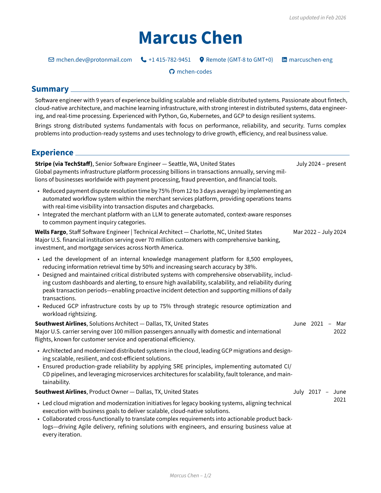
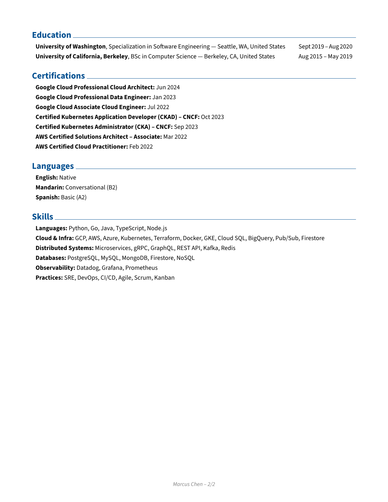

# Chameleon — Resume Tailor

Chameleon is a [Claude Code](https://claude.ai/claude-code) and [Codex](https://openai.com/codex/) project that tailors a master resume YAML to a specific job posting and renders it to PDF using [RenderCV](https://docs.rendercv.com/).

It is designed for one job: start from a truthful master CV, adapt the wording to match a target job description, and produce a ready-to-submit PDF without inventing experience.

## What It Does

- Keeps your master CV unchanged
- Creates a separate tailored YAML for each application
- Rewrites only allowed parts of the resume to match the job description's language
- Renders the tailored YAML to PDF with RenderCV
- Works in both Claude Code and Codex

## Constraints

- No fabricated experience, skills, metrics, titles, or dates
- Only rewording, reordering, and emphasis changes are allowed
- The master CV is never modified during a tailoring run

## Prerequisites

- Python 3.10+
- [Claude Code](https://claude.ai/claude-code) or [Codex](https://openai.com/codex/)

## Installation

```bash
git clone https://github.com/davidalecrim1/chameleon.git
cd chameleon
make install-tools
```

This creates a `.venv` and installs `rendercv` inside it.

## Quick Start

### 1. Start Claude Code or Codex

All project commands are exposed as slash commands:

- `/init-cv`
- `/chameleon`
- `/render-cv`

Claude Code:

```bash
claude
```

Codex:
```bash
codex
```

### 2. Import your master CV once

If your source resume is a PDF:

```
/init-cv ~/Downloads/david-alecrim.pdf
```

If you already have a RenderCV-compatible YAML:

```
/init-cv ~/Documents/david-alecrim.yaml
```

This creates a RenderCV-compatible master file under `templates/` and runs a render check.

### 3. Tailor for a job posting

Pass either a job URL:

```
/chameleon https://jobs.example.com/senior-engineer-123
```

Or pasted job description text:

```
/chameleon "Senior Software Engineer at Acme Corp. We're looking for..."
```

If you have more than one master CV in `templates/`, specify which one to use with `--cv <name>`, where `<name>` is the filename stem before `_cv.yaml`:

```
/chameleon --cv john_doe https://jobs.example.com/senior-engineer-123
```

This resolves to `templates/john_doe_cv.yaml`.

The tailoring flow will:

1. Fetch and analyze the job description
2. Rewrite the summary, reorder experience highlights, and update `bold_keywords`
3. Save a tailored YAML to `templates/<company>_<role>_cv.yaml`
4. Render it to PDF via `make render`
5. Report the path to the generated PDF

### 4. Re-render after a manual edit

To render any existing YAML again:

```
/render-cv templates/acme_corp_senior_engineer_cv.yaml
```

Or run it without arguments to pick from a list:

```
/render-cv
```

## How Files Are Organized

- `templates/*_cv.yaml`: master and tailored CV YAML files
- `output/`: rendered PDF, HTML, Markdown, and image output
- `.claude/agents/`: shared agent prompts used by the workflow
- `.claude/skills/`: shared slash-command skill definitions

## Notes

- `templates/<name>_cv.yaml` is treated as a master CV when you pass `--cv <name>`
- Tailored files are written as `templates/<company>_<role>_cv.yaml`
- If RenderCV is missing, run `make install-tools`

## Output

Rendered PDFs land in `output/`. This directory is not committed.

### Example

The following is the master template CV rendered to PDF:




## License

MIT — see [LICENSE](LICENSE).
